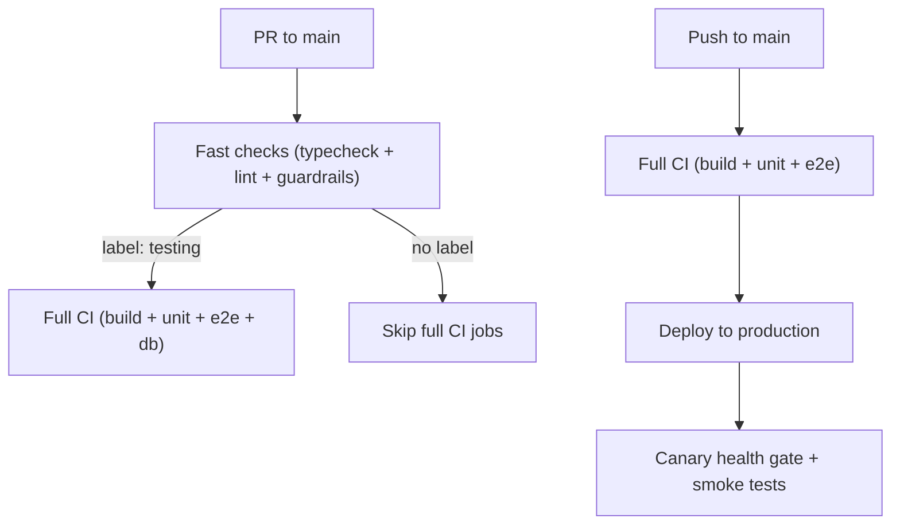

# GitHub Workflows

## Deployment Model

This repository uses trunk-based development with a single long-lived branch:

- **`main`** → deploys directly to **jov.ie** (production)
- PRs run fast checks (typecheck, lint) - ~30 seconds
- Push to main runs full CI (build, tests, E2E) then deploys to production
- Post-deploy: canary health gate + production smoke tests

## Vercel Preview Deployments

### Preview Deployment Workflow

Vercel preview deployments for pull requests and feature branches are handled by the `ci.yml` workflow via the `ci-pr-vercel-preview` job.

#### Features:

- Automated preview deployments for pull requests
- PR comment with deployment URL
- Manual triggering via workflow_dispatch for specific PRs
- Fork safety and concurrency controls

#### Triggers:

- Pull request events (opened, reopened, synchronize)
- Push events to non-main branches
- Manual workflow dispatch with PR number input

#### Secrets:

- `VERCEL_TOKEN` - Vercel API token
- `VERCEL_ORG_ID` - Vercel organization ID
- `VERCEL_PROJECT_ID` - Vercel project ID
- `GITHUB_TOKEN` - Automatically provided by GitHub Actions

## CI Workflow

The main CI workflow `ci.yml` is the gatekeeper for PRs to `main`. It includes:

- **Fast checks** (typecheck, lint) - runs on all PRs, required for merge
- **Full CI** (build, unit tests, E2E) - runs on push to main before deploy
- **Production deploy** - automatic deployment to jov.ie after CI passes
- **Canary health gate** - verifies deployment health before declaring success
- **Smoke tests** - validates critical paths after deploy
- **Lighthouse CI** - performance metrics on each deploy

### Change Detection (Path Guards)

`ci-change-detect` runs once per workflow and decides which heavy jobs should run (build, tests, E2E, Drizzle). Downstream jobs read its outputs instead of re-running path checks, which reduces YAML duplication and avoids drift.

## CI Overview (PR vs Main)

## Auto-Merge

The `auto-merge.yml` workflow handles automatic merging for:

- Dependabot PRs (patch/minor updates)
- Codegen PRs
- PRs with `auto-merge` label (after CI passes)

## Synthetic Monitoring

The `synthetic-monitoring.yml` workflow runs golden path tests against jov.ie on a schedule to catch production issues.

## Neon Database

- **Ephemeral branches** - Created per PR for isolated testing
- **Cleanup** - `neon-ephemeral-branch-cleanup.yml` deletes branches when PRs close
- **Protected branch** - `main` is the production database branch
