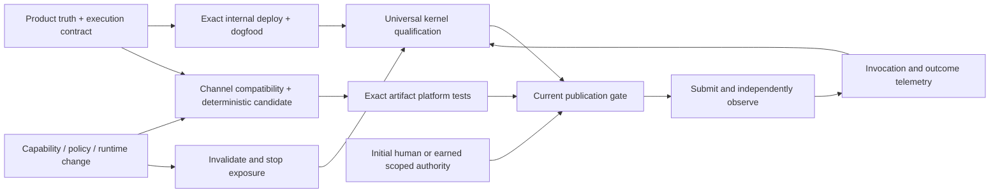

# Capability distribution architecture

Tracking: [JOV-7310](https://linear.app/jovie/issue/JOV-7310), prerequisite to
[JOV-7309](https://linear.app/jovie/issue/JOV-7309).
Status: proposed decision packet; architecture approval and independent reviews
are not yet recorded. Owner: Tim White for initial design/publication authority;
engineering for contracts, certification and adapters; operations for recovery.
Source inspection: `d488897b7944e54a5b6bb58768148a88fdc39204`, October 2, 2026.

The bottleneck is an absent shared distribution contract. The seven distribution
issues cannot safely converge while packaging, certification and publication can
each infer a different capability or version. This proposal joins existing
owners, makes the publication decision reproducible, and starts with an existing
Smart Link retrieval job. Success means one real capability reaches two agent
ecosystems through the same business implementation, with exact receipts and an
observed stop/recovery path. A package or green source check does not prove that.

This document introduces no runtime, permission, publication or certification
grant. Its merge is not the initial architecture approval required by JOV-7310.

## Existing ownership and observed gaps

Paths below are source evidence at the inspected revision, not deployed proof.
New distribution fields and transitions in later sections are proposals.

| Concern                                                                | Existing owner/source                                                                                                                                                                                                           | Proposed extension and boundary                                                                                                                                                       |
| ---------------------------------------------------------------------- | ------------------------------------------------------------------------------------------------------------------------------------------------------------------------------------------------------------------------------- | ------------------------------------------------------------------------------------------------------------------------------------------------------------------------------------- |
| Capability identity, maturity, disclosure and access                   | [Product truth registry](../../apps/web/data/product-truth/registry.ts)                                                                                                                                                         | Optional distribution declaration on the existing capability; absent means no external exposure. Keep `publication`, `access` and maturity distinct.                                  |
| Action identity, inputs/outputs, effect, confirmation and requirements | [Action descriptors](../../packages/action-contracts/descriptor.ts), [manifest](../../packages/action-contracts/manifest.ts)                                                                                                    | Reference the canonical action and its schema version; never copy executable policy into a wrapper. The four current actions include no Smart Link action and no generic read effect. |
| Existing public read contract and business execution                   | [Public API contract](../../apps/web/lib/api/v1/contract.ts), [music reads](../../apps/web/lib/agent-acquisition/music-read.ts), [MCP adapter](../../apps/web/lib/agent-acquisition/music-mcp.ts)                               | Reference the actual read schema/handler; do not force reads into a write descriptor. Music identity does not establish ownership or produce a Smart Link.                            |
| Auth, entitlements and ownership                                       | [Capability discovery](../../apps/web/lib/actions/capabilities.ts), [entitlement registry](../../apps/web/lib/entitlements/registry.ts), existing authenticated routes                                                          | Discovery is advisory. Invocation must resolve actor/profile server-side and repeat existing checks. Public per-artist MCP must not inherit authenticated workspace mutations.        |
| Evidence, decisions and certification lifecycle                        | [Certification kernel](../../apps/web/lib/agent-os/certification.ts), [CAS](../../apps/web/lib/agent-os/certification-cas.ts)                                                                                                   | Same kernel, typed packets, decisions and audit history. Distribution qualification adds evidence requirements; it does not replace universal certification.                          |
| Production dogfood and mission reliability                             | [Dogfood receipts](../../apps/web/lib/agent-os/dogfood-receipt.ts), [v2 design](../design-system/CERTIFICATION_V2_DOGFOOD.md)                                                                                                   | Evaluate the capability's existing assurance missions against the exact deployment; no synthetic or historical receipt substitution.                                                  |
| Durable packet decisions and unified review                            | [Packet files](../../apps/web/lib/ovie/certifications/packet-files.server.ts), [decisions](../../apps/web/lib/ovie/certifications/packet-decisions.ts), [inventory](../../apps/web/lib/ovie/certifications/inventory.server.ts) | Extend the existing `smart_links` domain for the canary; other capabilities map to their existing domain. No separate approval inbox.                                                 |
| Capability/channel compatibility and packaging metadata                | Product truth plus referenced execution contracts                                                                                                                                                                               | Pure derived projections. Channel policy records are declarative requirements, not authorization or copied connector credentials.                                                     |
| Company assets, value and candidate discovery                          | [Company assets](../operations/COMPANY_ASSETS.md), [source projection](../../scripts/company-assets/company-assets.mjs)                                                                                                         | Reference canonical capability/channel IDs; do not copy current capability or certification state into the asset projection.                                                          |
| Ecosystem change intake and backlog reconciliation                     | [Capability events](../../scripts/capability-benchmark/capability-reconciliation.mjs)                                                                                                                                           | Extend existing event classes and semantic deduplication. No new event bus, polling controller or per-connector issue spray.                                                          |
| Recovery                                                               | [Rollback playbooks](../../apps/web/lib/deployments/rollback-playbooks.ts)                                                                                                                                                      | Add external-artifact handling to the owning release class, stop signal and drill evidence; retain its existing owner.                                                                |
| Operational state persistence                                          | [Existing PostgreSQL record backend](../../apps/web/lib/ovie/mcp/postgres-backend.ts)                                                                                                                                           | Reuse the existing certification adapter/backend and CAS for publication attempts. No new certification database or independent controller.                                           |

Important source gaps constrain the design:

- The kernel currently exposes `working`, `review_ready`, `founder_locked`,
  `shipped`, `monitored`. The v2 document's confidence/window/rollout sequence is
  a design, not evidence that those states are implemented. Compose current
  admitted state and current dogfood; implementation of earned publication
  authority belongs to JOV-7313.
- [Action discovery](../../apps/web/app/api/v1/actions/route.ts) does not prove
  the documented invocation endpoint or durable write ledger exists. Each write
  must identify its real execution handler and replay/reconciliation mechanism
  before any adapter advertises support.
- [Agent draft tools](../../apps/web/lib/agent-acquisition/api.ts) and
  [release preparation](../../apps/web/lib/agent-acquisition/release-launch.ts)
  create/resume unpublished drafts. Their `published_url` and Smart Link URL
  are null. A signed draft token never grants ownership or publication.
- Dogfood receipt shape validation is not producer authentication. Trust must
  come from the existing authenticated driver/ingestion boundary and its
  immutable evidence reference. The Summer
  [receipt trust contract](../../scripts/summer-commissioning/receipt-trust.mjs)
  is prior art for verifier-supplied identity/context, not a claim that all
  product dogfood producers already attest receipts.
- [Supported platforms](../../apps/web/lib/platform/supported-platforms.ts)
  covers client/version lifecycle families. Connector manifests cover consuming
  providers. Neither should be relabeled as marketplace review policy.

## One joined lifecycle



Candidate packaging precedes platform certification because those tests must run
against the bytes that would be submitted. Packaging is a local, reversible
operation. Submission/publication follows all gates. A richer GUI may proceed in
parallel; it is required only when the job or assurance missions depend on it.

### Canonical declarations and derived results

JOV-7311 extends the product-truth capability with an optional distribution block:
execution reference (existing action ID/version or existing public read contract),
user job, schema references, data classes, retry/idempotency reference, cost and
latency class, recovery reference, required dogfood missions, disclosure/access
constraints and result/render types. Action-owned effect/auth/confirmation/schema
fields are resolved from that action; conflicting declarations fail validation.
Existing read handlers explicitly declare `read` and their public-data boundary.
Persisting a draft is a write regardless of whether its annotation sounds safe.

JOV-7312 adds a declarative channel-profile collection alongside product truth,
referenced by stable IDs; these records own external policy metadata only.
Each profile contains protocol/format versions, auth/tenant binding, permitted
effects and confirmations, schema/result constraints, metadata, review/submission,
privacy/retention, commerce, quota/latency/reliability, update/revocation semantics,
prohibited behavior and evidence provenance. Each policy dimension has an
effective date, evidence snapshot/digest, expiry or material invalidation event,
and state `verified`, `unknown` or `unsupported`. An unknown required dimension
blocks qualification. The company asset projection references profiles without
copying their mutable rules.

The compiler accepts immutable capability and profile snapshots. It returns
`compatible`, `incompatible`, `transformation_required`, `certification_required`
or `blocked`, plus stable reason codes and the input digests. Schema or rendering
transformations must preserve the underlying job, auth/effect and error semantics;
an altered job is a different contract. Compatibility never carries publish
authority. New capability/profile revisions re-evaluate affected channels through
the existing material-event path.

### Exact binding

Every candidate and publication attempt binds this full tuple:

```text
capabilityId, capabilityRevisionDigest, executionContractDigest,
runtimeRepository, runtimeCommitSha, deploymentId, runtimeEnvironment,
channelId, profileRevisionDigest, packagingAdapterRevision,
artifactSha256, policyEpoch
```

Capability revision is a digest of the canonical distribution declaration and
resolved execution contract. Artifact digest covers the complete packaged bytes,
including manifests, scripts, descriptions and generated schemas. Canonical
serialization sorts keys and normalizes declared values; array order remains
meaningful unless the schema explicitly defines a set. Deterministic packaging
must exclude build timestamps and uncontrolled network inputs.

The existing universal subject remains the capability. Target certification is
a channel-qualified subject referencing that universal subject in the same
kernel/domain packet system; it must not overwrite another channel's packet or
decision. Its invariant-evaluation evidence binds the tuple. Universal and target
source expectations, deployment and dogfood are resolved independently by the
trusted adapter, not accepted as caller-supplied booleans. Unsupported domain or
missing trustworthy ingestion blocks publication; no ad-hoc JSON pass substitutes.

Operational receipts remain outside the kernel's taste decision digest, as they
are today. The publication gate therefore checks their current tuple, producer,
outcome and freshness separately on every attempt. A prior founder decision
cannot make a changed runtime or failed dogfood current again.

## Publication and recovery mechanism

Distribution states below are operational projections on the existing
certification adapter's record, not a second certification lifecycle.

| Transition                                    | Required condition                                                                                                                                 | Failure/uncertainty behavior                                                                                                  |
| --------------------------------------------- | -------------------------------------------------------------------------------------------------------------------------------------------------- | ----------------------------------------------------------------------------------------------------------------------------- |
| absent → `candidate`                          | Explicit eligible capability, deterministic package and complete tuple                                                                             | Missing declaration stays internal; incompatible/unknown policy stays blocked.                                                |
| `candidate` → `qualified`                     | Exact deployed capability, required real dogfood, universal and target certification, security/entitlement/recovery checks all current and passing | Missing, failed, expired, revoked or mismatched evidence leaves candidate blocked with reasons.                               |
| `qualified` → `authorized`                    | Tim's exact first-publication approval, or current earned authority scoped to capability/channel/risk/tuple under JOV-7313                         | No inherited organizational approval, historical approval or silence grants initial publication.                              |
| `authorized` → `submitting`                   | Existing CAS reserves one operation; immediately re-read every gate and provider account/environment                                               | Gate changed: stop before dispatch. Unsupported automated submission: exact packet plus `human_action_required`.              |
| `submitting` → `review_pending` / `published` | Provider receipt and independent readback bind submitted bytes/version and review state                                                            | Timeout/ambiguous response: `submission_unknown`; reconcile before retry. A successful HTTP status is insufficient.           |
| `review_pending` → `published`                | Provider acceptance plus fresh full gate check immediately before enabling runtime exposure                                                        | Expired approval/evidence or drift blocks exposure and requests withdrawal/correction.                                        |
| any exposed state → `quarantined`             | Auth/privacy violation, failed required dogfood, revoked authority, runtime mismatch or unsafe policy uncertainty                                  | Local capability/channel kill switch denies invocation immediately; attempt provider disable/withdrawal and observe outcome.  |
| `quarantined` → `withdrawn` / `recovered`     | Observed provider removal, or prior artifact requalified under current rules and explicitly authorized recovery                                    | Unsupported removal is an owned human action; no claim of withdrawal until observed. Unsafe prior artifact stays quarantined. |

The release gate is the conjunction of all eight requirements in JOV-7314:
exact capability, deployed internal runtime, required privileged dogfood,
universal certification, target certification, privacy/auth/effect/entitlement
checks, valid publication authority and exact artifact. Local policy/control
unavailability fails closed. Evidence producers may revoke receipts; failed
receipts cannot be outvoted by successes or confidence. Required mission
reliability uses the existing dogfood evaluator, including kind and driver rules.

Initial publication and authority expansion require the existing authenticated
human decision path. JOV-7313 may subsequently propose narrowly earned automatic
updates, but telemetry alone never grants them. Scope includes channel, capability,
risk class, update class, evidence version, expiry and revocation. Listing/public
marketing permission does not imply permission to submit or invoke.

The operation key is the tuple digest plus operation (`submit`, `update`,
`withdraw`, `rollback`) and target provider account/environment. Same key and
same bytes returns/reconciles the recorded result; same key with different bytes
is a conflict. Persist intent before external dispatch. Reuse provider idempotency
where documented; without it, resolve unknown outcomes by readback rather than
blindly retrying. CAS retry functions are pure and must never call providers.

Persist `policyEpoch` with intent. A capability/profile/authority/runtime change
increments the affected epoch and invalidates unexecuted reservations. Recheck
before dispatch and after provider readback; an in-flight epoch change triggers
quarantine even if the remote operation succeeds. Local CAS cannot atomically
control a marketplace: the local deny switch is the immediate safety boundary,
and readback/withdrawal handles the remote race. Publishers must refuse work
when the invocation runtime cannot enforce that switch.

Rollback is not unconditional replay of a once-green artifact. Recheck current
platform rules, authority, data rights and runtime compatibility first. Pin the
last known certified bytes and the existing release playbook's stop/observed
completion evidence. A rule prohibiting the old artifact requires withdrawal or
forward repair. Token revocation and tenant denial remain with their canonical
auth owners; listings are not the enforcement boundary.

## Rule drift, telemetry and ownership

JOV-7315 consumes the existing source-bound capability event and reconciliation
path. Each event resolves changed dimensions and affected capability/channel
bindings. Invalidate only dimensions whose input digests changed, while retaining
the unchanged receipts for audit. A new target packet must bind the full new
tuple; retained evidence is reused only through explicit immutable references
whose prerequisites still match. Unknown impact invalidates publication until
classified. No stale profile expires into a pass.

JOV-7314 records discovery/install/connect only where the platform exposes it,
then invocation, outcome, latency, failure, account activation, attributable
conversion/revenue, review and recovery. Keep measurement availability explicit.
Attribution uses existing acquisition/analytics references and consent; provider
IDs do not become Jovie user identity. Do not retain raw user arguments, draft
tokens, PII or provider content in generic telemetry. Aggregate outcomes feed the
existing confidence/evidence owners, never a second permission engine.

Engineering owns contract/compiler/platform test correctness. The existing
capability execution owner owns runtime enforcement and failures. Operations
owns external attempt reconciliation, incident escalation and recovery playbooks.
Summer consumes material deltas through its existing integration; uncommissioned
Summer runtime or absent deployment authority does not create a replacement
scheduler. Persist an owner, reason, event and next observable action for every
unknown submission or failed withdrawal. Linear remains the durable work owner.

## Initial channels and Smart Link proof

OpenAI agent/plugin/MCP/skills packaging and Claude remote-MCP/plugin packaging
are separate profile candidates, not two verified deployments. On October 2,
2026 this environment could not retrieve the following first-party references
(HTTPS proxy denied each request with 403):

- [OpenAI app submission guidance](https://developers.openai.com/apps-sdk/app-submission-guidelines)
- [OpenAI MCP server guide](https://developers.openai.com/apps-sdk/build/mcp-server)
- [Claude remote connector guidance](https://support.claude.com/en/articles/11503834-building-custom-connectors-via-remote-mcp-servers)
- [Claude plugin reference](https://code.claude.com/docs/en/plugins-reference)

These are research pointers, not captured policy evidence. JOV-7312 must verify
the current supported surface and full profile from first-party sources before
certifying it. Local MCP protocol support proves neither directory admission nor
marketplace reach. [Meta Muse reconciliation](../operations/META_MUSE_RECONCILIATION.md)
already records the independent consume/distribute decisions; its pending probe
stays with JOV-7315/JOV-7311. Data-provider channels (Exa Connect, JOV-7317) add
rights/provenance, redistribution constraints, request/response contract,
per-call economics and payout; plugin policy cannot substitute for those fields.

JOV-7316 starts with resolving a confirmed identity and retrieving an existing
public Smart Link, if the canonical handler actually supports that job. Missing
lookup support is a canonical product gap, not permission to add marketplace-only
business logic. Creation/reuse is a separate write-bearing extension requiring
ownership, durable idempotency and reversible recovery. Draft preparation cannot
pass the published-URL mission. Keep existing pricing unchanged.

Required production missions cover selected identity and ambiguity; valid release
input; existing-link reuse; authorized new creation when supported; malformed and
private/unauthorized input; retry/concurrency; provider failure/cancellation; and
the returned URL actually resolving. Prove each supported operation through
internal API/CLI/MCP and then each exact external artifact. Missing auth transport
or write capability remains a reported gap. Two materially different ecosystems
must produce independent observed runtime receipts; two local manifests do not
satisfy JOV-7316.

## Migration, boundaries and decisive validations

| Issue    | Bounded delivery                                                                                                                               | Acceptance that enables the next dependency                                                                                                   |
| -------- | ---------------------------------------------------------------------------------------------------------------------------------------------- | --------------------------------------------------------------------------------------------------------------------------------------------- |
| JOV-7310 | This packet, reconciled independent reviews, exact initial architecture approval                                                               | No approval is implied by a merge; approved document digest/revision and reviewer/decision evidence are recorded.                             |
| JOV-7311 | Opt-in product-truth metadata; resolved execution references; pure compiler and deterministic candidate packaging                              | Real read/write fixtures use existing logic; unsupported effects, unknown policy, metadata disagreement and stale input digests fail closed.  |
| JOV-7312 | Versioned evidence-backed profiles; additive platform tests through the same certification kernel                                              | Same capability legitimately passes one profile and fails another; receipts bind exact profile/capability/artifact and policy dimensions.     |
| JOV-7313 | Exact human initial authority; scoped confidence and earned update decisions in existing decision/assurance owners                             | Revocation, expiry, changed tuple, new permissions and conflicting human decisions cannot silently promote.                                   |
| JOV-7314 | Existing adapter/CAS publication state, disabled publishers until authority exists, local runtime stop, reconciliation, telemetry and recovery | Red privileged dogfood blocks publish despite green platform tests; race/timeout/replay/withdrawal/rollback drills prove observed outcomes.   |
| JOV-7315 | Existing capability-event intake, dimension impact, profile drift and backlog reconciliation                                                   | Duplicate event creates no new work; material change invalidates affected receipts; missed-event recovery uses existing integration.          |
| JOV-7316 | Canonical Smart Link proof, internal and two external runtime missions                                                                         | Exact deployed receipts, URL outcome, publication authority and recovery prove the job; candidate-only or missing ecosystem proof stays open. |

Migration is additive and opt-in. Existing product-truth projections, action
bindings, customer access and certification domain packets retain their owners.
Introduce declaration validation first, then deterministic compatibility,
candidate platform tests, authority and a disabled publication adapter. Exercise
the existing backend/CAS and domain inventory before any provider call. Enable
the thinnest faithful canary only with current receipts and the exact first
publication decision. Reversing exposure uses the local stop switch first,
observed provider withdrawal second; reverting metadata cannot undo a submission.

The downstream regression matrix must include swapped artifact bytes; stale
runtime/deployment/profile; spoofed dogfood producer; retained secret data;
failed privileged dogfood with green platform tests; unknown rule impact; reused
or revoked authority; cross-tenant/account operation keys; CAS contention; crash
before/after remote submission; missing readback; epoch change during submission;
rejected provider review; unsupported automated withdrawal; and rollback invalid
under current rules. Verify the source fixtures, hosted checks, exact deploy,
actual dogfood and provider readback as distinct evidence layers.

## Decisions requiring review

Ship now: the reviewable architecture packet and source-grounded ownership map.
Re-evaluate when: independent role objections are reconciled and Tim records the
exact initial design decision. Then: admit the bounded implementation children;
external submission remains disabled until its separate publication gates pass.

The proposed tradeoffs are explicit: profile policy lives alongside product truth
rather than the client platform matrix; channel-qualified certification subjects
reuse the same kernel rather than overwriting the universal packet; CAS reserves
local intent but cannot promise remote exactly-once execution; local invocation
denial is required because marketplace withdrawal may be delayed or unavailable.
Reviewers should reject a choice if existing ownership cannot enforce it and name
the existing owner that can.

## Independent adversarial review and approval receipts

No independent review has been recorded in this revision. The author cannot
self-certify these perspectives. Two independent reviewers may cover three roles
each; record actual reviewer identities, inspected document digest, source
revision, objections and their disposition. Use multiple model perspectives when
available without claiming they ran when they did not.

| Required role                          | Questions that can invalidate this plan                                                                                                  | Receipt |
| -------------------------------------- | ---------------------------------------------------------------------------------------------------------------------------------------- | ------- |
| Security/privacy/permissions           | Can forged receipts, draft tokens, tenant mixups or retained PII grant exposure? Is invocation denial enforced by its actual owner?      | Pending |
| Platform policy/marketplace review     | Are unknown rules treated as pass? Are protocol support, directory admission and publication permission distinguished?                   | Pending |
| Reliability/rollback/stale artifacts   | Can a timeout duplicate a submission? Can an in-flight epoch change or newly prohibited old artifact escape quarantine?                  | Pending |
| Product/distribution usefulness        | Does the canary complete a real Smart Link job? Are draft URLs or two manifests being counted as user outcomes?                          | Pending |
| Certification integrity/false green    | Are universal, platform, deployed/runtime and privileged dogfood receipts all independently bound? Can confidence outvote a failed gate? | Pending |
| Operational ownership/failure recovery | Which existing owner reconciles unknown submission, failed withdrawal and absent runtime enforcement? Is any new controller hiding here? | Pending |

Architecture approval: **not recorded**. Approval must identify this packet's
exact reviewed revision/digest and the reconciled independent-review evidence.
First marketplace publication is a separate decision on its exact artifact,
runtime and channel. JOV-7310 and its downstream dependency edges remain open
until their actual acceptance criteria are met.
