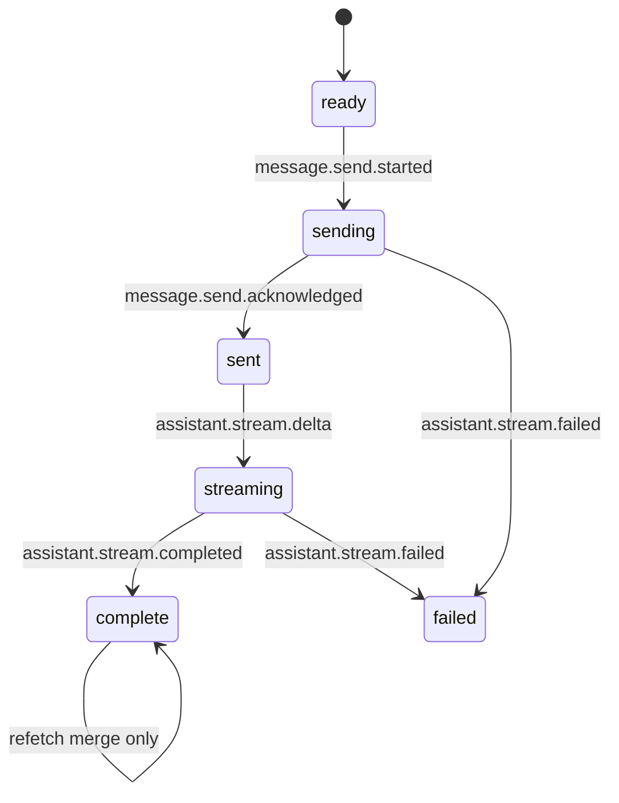

# Chat Timeline Reliability

Issue: JOV-2559

## Root Cause

Chat rendering previously had multiple competing state sources:

- AI SDK `messages` rendered directly.
- Query-loaded conversation messages were converted and pushed back through `setMessages`.
- `JovieChat` created a render-only `displayMessages` array with a synthetic thinking row.
- Route loading files and component loading gates showed different skeleton layouts.
- Post-stream invalidation, title polling, and route replacement could refetch older persisted data after the streamed UI already looked settled.

That meant the visible transcript could alternate between local optimistic state, stream state, query cache state, and remounted route state. A late query result could remove optimistic rows, replace streamed content, or change message IDs after the row was already visible.

## Current Contract

Rendering now consumes one canonical `ChatTimelineState.messages` list. Other sources only dispatch reducer events:

The reducer owns stable render keys:

- User row: `user:${clientTurnId}`
- Assistant row: `assistant:${clientTurnId}`
- Server IDs, `turnId`, and `clientMessageId` are metadata used for reconciliation, not row keys.

## Invariants

- Do not render a second message array.
- Do not use array indexes as message keys.
- Do not call AI SDK `setMessages` from query/cache data.
- Refetches must merge by `turnId`, `clientMessageId`, server ID, then conservative fallback.
- Local sending, streaming, failed, and locally completed rows are never removed by refetch.
- Background refetches do not show page or message skeletons.
- Sending appends user and assistant pending rows without clearing existing messages.
- Streaming updates the same assistant row.
- Completion is only a forward lifecycle transition; stale data may merge metadata but not replace newer visible content.
